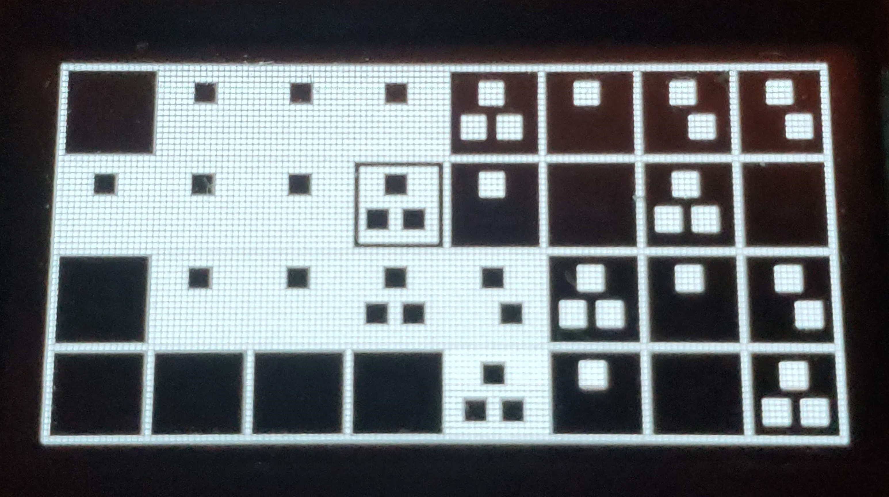

# game-rectangular-prism

Versions 1 and 2 of the Game Rectangular Prism, a small video game console.

### Version 2

Version 2 is more advanced and recent.

It is Asteroids, Astro Party, Clonium, and Minesweeper games and Random Number Generator and Level utilities on an Arduino Nano 33 IoT with a 64x128 OLED screen, 4 capacitive touch buttons, an EEPROM module, a 9v battery, and a power switch all in a black 3D printed case.

[3D files on Thangs](https://thangs.com/m/15227)

### Version 1

Version 1 is the original.

It is Astro Party on an Arduino Nano Every with a 64x128 OLED screen, 4 buttons, a 9v battery, and a power switch all in a white 3D printed case.

[3D files on Thangs](https://thangs.com/m/15230)

## Photos

### Version 2

### Version 1

## License

GPL-3.0 License
